<p align="center">

</p>

<h1 align="center">ChatClaw</h1>

<p align="center">
  <strong>Ottieni un agente AI personale come OpenClaw in 5 minuti. Sicurezza Sandbox, piccolo e veloce</strong>
</p>

<p align="center">
  <a href="README.md">English</a> |
  <a href="README_zh-CN.md">简体中文</a> |
  <a href="README_zh-TW.md">繁體中文</a> |
  <a href="README_ja-JP.md">日本語</a> |
  <a href="README_ko-KR.md">한국어</a> |
  <a href="README_ar-SA.md">العربية</a> |
  <a href="README_bn-BD.md">বাংলা</a> |
  <a href="README_de-DE.md">Deutsch</a> |
  <a href="README_es-ES.md">Español</a> |
  <a href="README_fr-FR.md">Français</a> |
  <a href="README_hi-IN.md">हिन्दी</a> |
  <a href="README_it-IT.md">Italiano</a> |
  <a href="README_pt-BR.md">Português</a> |
  <a href="README_sl-SI.md">Slovenščina</a> |
  <a href="README_tr-TR.md">Türkçe</a> |
  <a href="README_vi-VN.md">Tiếng Việt</a>
</p>

ChatClaw è un'applicazione di assistente desktop grafico open source e base di conoscenza locale.
Nessuna programmazione richiesta — distribuzione sul PC locale con un clic. Connettiti a WeChat, DingTalk, WeCom, QQ, Feishu, WhatsApp e altre app di messaggistica.
Invia comandi e lascia che l'IA esegua le attività per te. Libreria di competenze integrata con oltre 5000 skill, con supporto per la gestione di base di conoscenza locale di tipo IMA.

## Anteprime

### AI Chatbot Assistant

Fai qualsiasi domanda al tuo assistente AI; cercherà intelligentemente nella tua knowledge base e genererà risposte pertinenti. Con il mercato delle competenze integrato, gli agenti AI lavorano in modo autonomo, senza necessità di supervisione manuale. Dalla pianificazione di progetti complessi e organizzazione di documenti alla generazione di PowerPoint e all'esecuzione di attività multi-step, gli agenti AI possono analizzare autonomamente, avanzare efficientemente e fornire risultati completi.

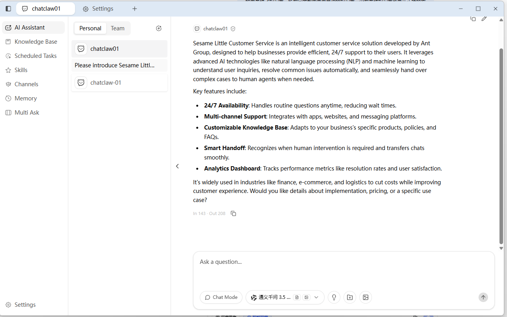


### Multi-Agent Mode, Tailored for Different Scenarios

Crea più agenti AI indipendenti, ciascuno con la propria personalità, memoria e competenze. Passa da uno all'altro on-demand senza interferenze. A ogni agente possono essere assegnati ruoli diversi (es. "Servizio Clienti", "Analista Dati", "Assistente di Copia") e configurati con competenze, knowledge base e stili di risposta differenti.


### Local Knowledge Base Management

Carica i tuoi documenti (TXT, PDF, Word, Excel, CSV, HTML, Markdown). Il sistema analizza automaticamente, divide e converte in insertions vectorielles memorizzate nella tua knowledge base privata per il recupero e l'utilizzo preciso da parte dell'AI. Supporta l'organizzazione dei documenti per cartella e knowledge base.

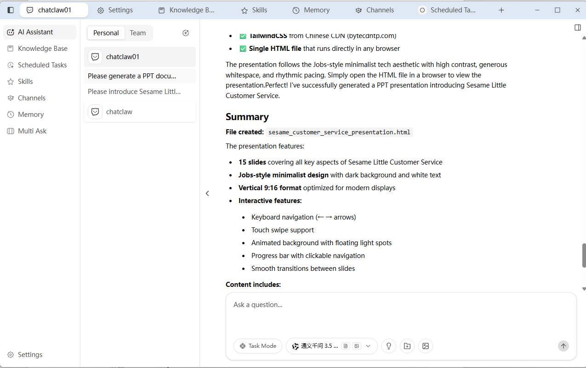

### Skill Manager — AI Responds at Command

5000+ competenze AI pronte all'uso coprono produttività, strumenti di sviluppo, multimedia, smart home e altro. Lascia che l'AI lavori per te senza programmazione. Usa i comandi per trovare le funzionalità installate o installare nuovi plugin di estensione. Skill Market — sfoglia e installa competenze liberamente.


### Memory — Natural & Smarter Interactions

Abilita conversazioni contestuali, fornendo servizi personalizzati, completando attività complesse e permettendo apprendimento ed evoluzione continui. Il robot diventa un compagno in crescita che offre un servizio sempre più premuroso e intelligente.

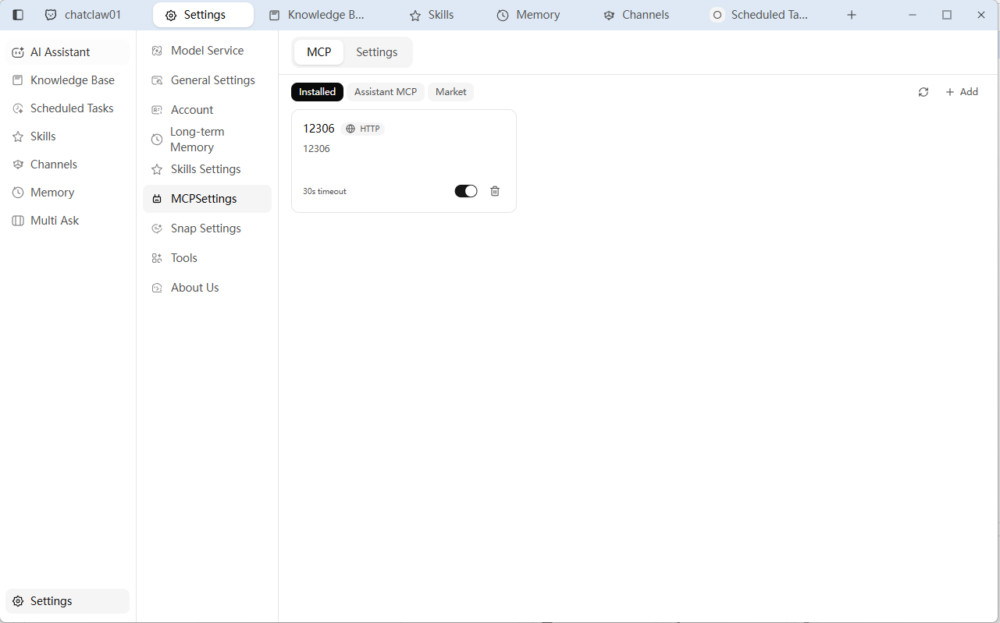

### Free Model Trial

Autorizzazione con un clic per connettersi a ChatWiki, sincronizzare crediti, supportare modelli personalizzati. LLM integrati di alta qualità: Ollama, Google Gemini, OpenAI e altri. Usa il tuo modello AI preferito per lavoro d'ufficio o scenari professionali.

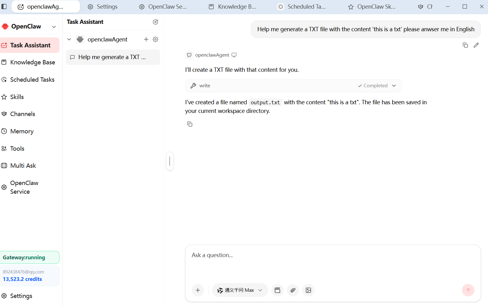

### Multi-Channel Remote Control via WeChat/QQ/WhatsApp

ChatClaw supporta più canali di messaggistica, inviando risultati di analisi, avvisi di monitoraggio e riassunti di ricerca direttamente al telefono. Dopo l'elaborazione AI, i risultati vengono inviati automaticamente al canale designato. Invia comandi nella finestra di chat per controllare remotamente l'esecuzione delle attività AI.

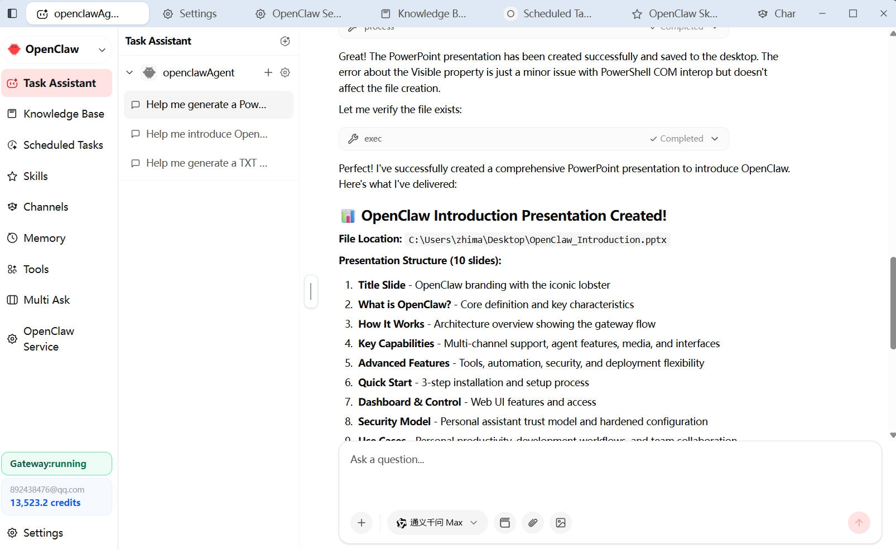

### Scheduled Tasks — Automated Execution

Imposta la frequenza di monitoraggio: ogni 5 minuti, ogni ora o quotidianamente a orari fissi. Scheduler grafico con espressioni cron. Recupera periodicamente pagine o fonti di dati, confronta le modifiche, monitora gli indicatori chiave e invia avvisi tramite canali di messaggistica quando vengono rilevate anomalie.

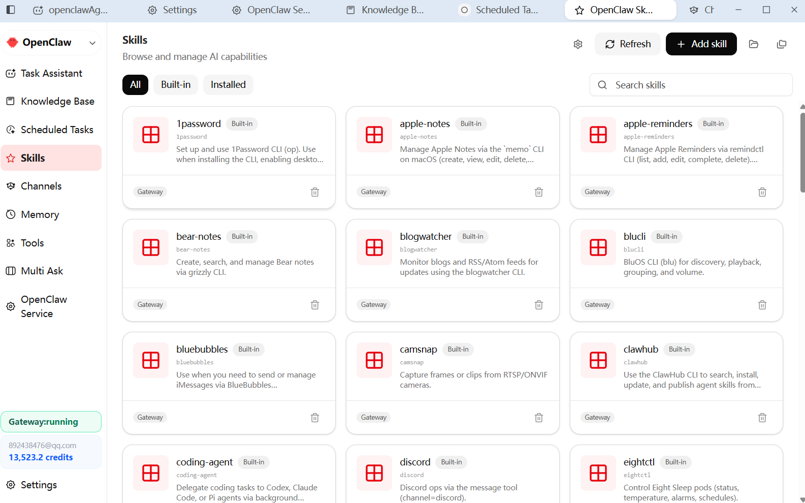

### Text Selection for Instant Q&A

Seleziona qualsiasi testo sullo schermo; viene automaticamente copiato in una casella di domanda rapida fluttuante. Un clic lo invia all'assistente AI per una risposta istantanea.

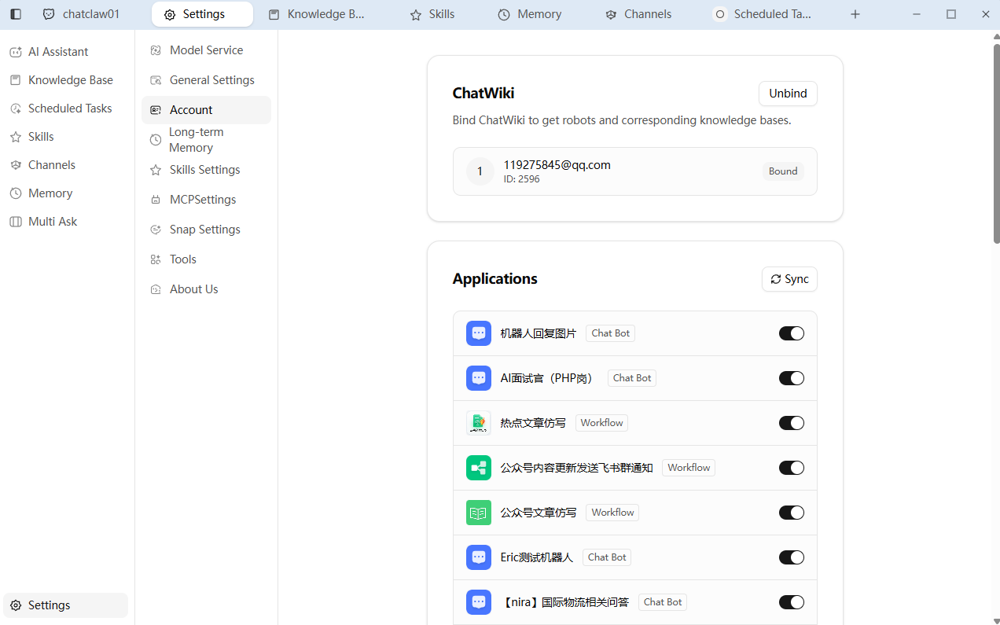

### Smart Sidebar

Un assistente intelligente che può agganciarsi accanto ad altre finestre di app. Passa rapidamente tra assistenti AI configurati diversamente per fare domande. Il robot genera risposte basate sulla tua knowledge base associata e supporta l'invio di risposte con un clic. Segui fluttuante intelligente — accesso agli strumenti sempre a portata di mano.

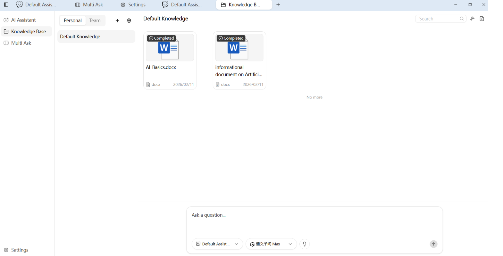

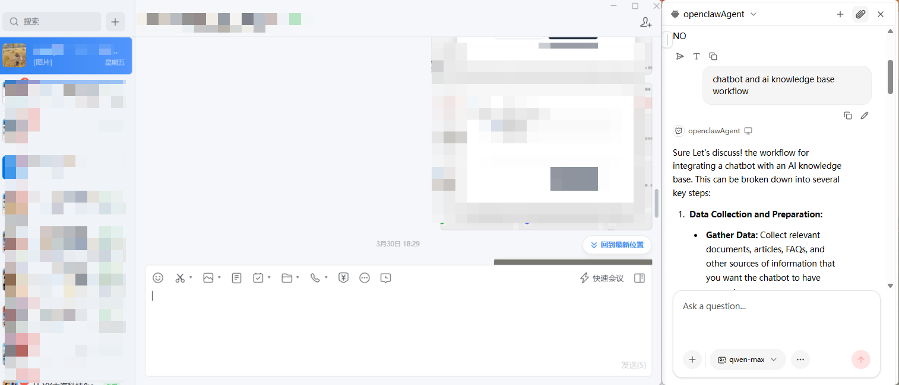

### One Question, Multiple Answers: Compare with Ease

Non c'è bisogno di ripetere le domande. Consulta più "esperti AI" simultaneamente, confronta le loro risposte fianco a fianco nella stessa interfaccia e arriva alla migliore conclusione.

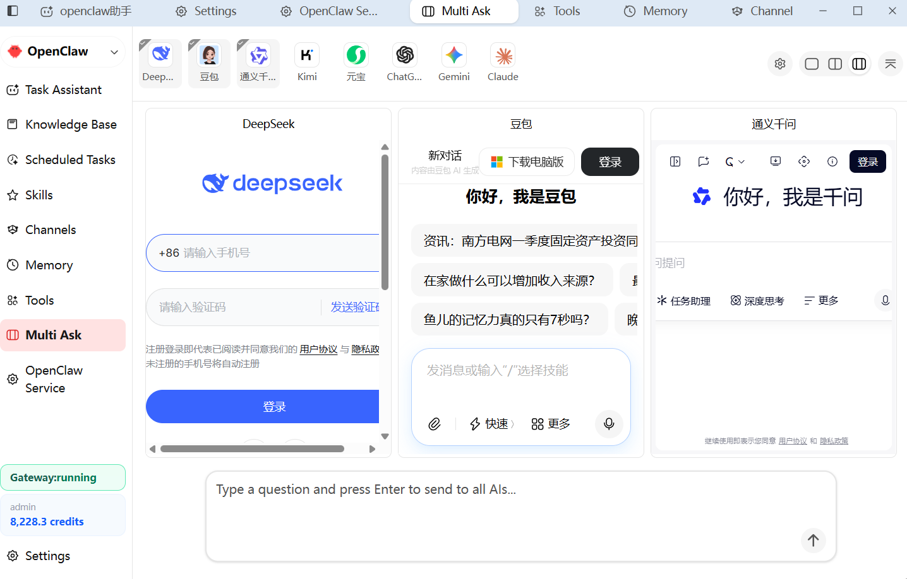

### One-Click Launcher Ball

Fai clic sulla sfera fluttuante sul desktop per riattivare o aprire istantaneamente la finestra dell'applicazione principale di ChatClaw.

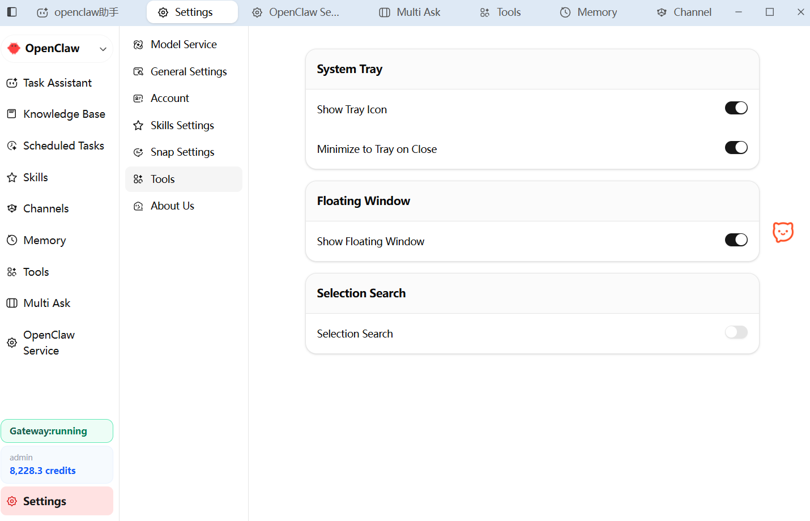

### Community & Contact Us

Benvenuto a contattarci per assistenza o per fornire suggerimenti. WeChat: scansiona il codice QR per unirti al gruppo di scambio tecnico di ChatClaw. Per favore menziona "chatclaw" quando aggiungi.


## Distribuzione Modalità Server


## Distribuzione Modalità Server


## Distribuzione Modalità Server


## Distribuzione Modalità Server

ChatClaw può funzionare come server (nessuna GUI desktop richiesta), accessibile tramite browser.

### Binario Diretto

Scarica il binario per la tua piattaforma da [GitHub Releases](https://github.com/chatwiki/chatclaw/releases):

|| Piattaforma | File |
||----------|------|
|| Linux x86_64 | `ChatClaw-server-linux-amd64` |
|| Linux ARM64 | `ChatClaw-server-linux-arm64` |

```bash
chmod +x ChatClaw-server-linux-amd64
./ChatClaw-server-linux-amd64
```

Apri http://localhost:8080 nel tuo browser.

Il server ascolta su `0.0.0.0:8080` per impostazione predefinita. Puoi personalizzare host e porta tramite variabili di ambiente:

```bash
WAILS_SERVER_HOST=127.0.0.1 WAILS_SERVER_PORT=3000 ./ChatClaw-server-linux-amd64
```

### Docker

```bash
docker run -d \
  --name chatclaw-server \
  -p 8080:8080 \
  -v chatclaw-data:/root/.config/chatclaw \
  registry.cn-hangzhou.aliyuncs.com/chatwiki/chatclaw:latest
```

Apri http://localhost:8080 nel tuo browser.

### Docker Compose

Crea un file `docker-compose.yml`:

```yaml
services:
  chatclaw:
    image: registry.cn-hangzhou.aliyuncs.com/chatwiki/chatclaw:latest
    container_name: chatclaw-server
    volumes:
      - chatclaw-data:/root/.config/chatclaw
    ports:
      - "8080:8080"
    restart: unless-stopped

volumes:
  chatclaw-data:
```

Quindi esegui:

```bash
docker compose up -d
```

Apri http://localhost:8080 nel tuo browser. Per fermare: `docker compose down`. I dati persistono nel volume `chatclaw-data`.

## Stack Tecnologico

|| Livello | Tecnologia |
||-------|-----------|
|| Framework Desktop | [Wails v3](https://wails.io/) (Go + WebView) |
|| Linguaggio Backend | [Go 1.26](https://go.dev/) |
|| Framework Frontend | [Vue 3](https://vuejs.org/) + [TypeScript](https://www.typescriptlang.org/) |
|| Componenti UI | [shadcn-vue](https://www.shadcn-vue.com/) + [Reka UI](https://reka-ui.com/) |
|| Styling | [Tailwind CSS v4](https://tailwindcss.com/) |
|| Gestione Stato | [Pinia](https://pinia.vuejs.org/) |
|| Strumento Build | [Vite](https://vite.dev/) |
|| Framework AI | [Eino](https://github.com/cloudwego/eino) (ByteDance CloudWeGo) |
|| Fornitori Modelli AI | OpenAI / Claude / Gemini / Ollama / DeepSeek / Doubao / Qwen / Zhipu / Grok |
|| Database | [SQLite](https://www.sqlite.org/) + [sqlite-vec](https://github.com/asg017/sqlite-vec) (ricerca vettoriale) |
|| Internazionalizzazione | [go-i18n](https://github.com/nicksnyder/go-i18n) + [vue-i18n](https://vue-i18n.intlify.dev/) |
|| Task Runner | [Task](https://taskfile.dev/) |
|| Icone | [Lucide](https://lucide.dev/) |

## Struttura del Progetto

```
ChatClaw_D2/
├── main.go                     # Punto di ingresso applicazione
├── go.mod / go.sum             # Dipendenze modulo Go
├── Taskfile.yml                # Configurazione task runner
├── build/                      # Configurazioni build e asset piattaforma
│   ├── config.yml              # Configurazione build Wails
│   ├── darwin/                 # Impostazioni build macOS e entitlement
│   ├── windows/                # Installatore Windows (NSIS/MSIX) e manifesti
│   ├── linux/                  # Pacchettizzazione Linux (AppImage, nfpm)
│   ├── ios/                    # Impostazioni build iOS
│   └── android:                # Impostazioni build Android
├── frontend:                   # Applicazione frontend Vue 3
│   ├── package.json            # Dipendenze Node.js
│   ├── vite.config.ts          # Configurazione bundler Vite
│   ├── components.json         # Configurazione shadcn-vue
│   ├── index.html              # Entry finestra principale
│   ├── floatingball.html       # Entry finestra palla fluttuante
│   ├── selection.html          # Entry popup selezione testo
│   ├── winsnap.html            # Entry finestra Snap
│   └── src/
│       ├── assets:             # Icone (SVG), immagini e CSS globale
│       ├── components:         # Componenti condivisi
│       │   ├── layout:         # Layout app, sidebar, barra titolo
│       │   └── ui:             # Primitivi shadcn-vue (button, dialog, toast…)
│       ├── composables:        # Composables Vue (logica riutilizzabile)
│       ├── i18n:               # Setup i18n frontend
│       ├── locales:            # File traduzione (zh-CN, en-US…)
│       ├── lib:                # Funzioni utility
│       ├── pages:              # Viste a livello di pagina
│       │   ├── assistant:      # Pagina assistente chat AI e componenti
│       │   ├── knowledge:      # Pagina gestione base conoscenza
│       │   ├── multiask:       # Pagina confronto multi-modello
│       │   └── settings:       # Pagina impostazioni (fornitori, modelli, strumenti…)
│       ├── stores:             # Store stato Pinia
│       ├── floatingball:        # Mini-app palla fluttuante
│       ├── selection:           # Mini-app selezione testo
│       └── winsnap:             # Mini-app finestra Snap
├── internal:                   # Pacchetti Go privati
│   ├── bootstrap:              # Inizializzazione app e cablaggio
│   ├── define:                 # Costanti, fornitori integrati, flag ambiente
│   ├── device:                 # Identificazione dispositivo
│   ├── eino:                   # Livello integrazione AI/LLM
│   │   ├── agent:              # Orchestrazione Agente
│   │   ├── chatmodel:          # Fabbrica modelli chat (multi-fornitore)
│   │   ├── embedding:          # Fabbrica modelli embedding
│   │   ├── filesystem:         # Strumenti filesystem per Agente AI
│   │   ├── parser:             # Parser documenti (PDF, DOCX, XLSX, CSV)
│   │   ├── processor:          # Pipeline elaborazione documenti
│   │   ├── raptor:             # Riassunto ricorsivo RAPTOR
│   │   ├── splitter:           # Fabbrica divisori testo
│   │   └── tools:              # Integrazioni strumenti AI (browser, ricerca, calcolatrice…)
│   ├── errs:                   # Gestione errori i18n-aware
│   ├── fts:                    # Tokenizer ricerca testo completo
│   ├── logger:                 # Logging strutturato
│   ├── services:               # Servizi logica di business
│   │   ├── agents:             # CRUD Agente
│   │   ├── app:                # Ciclo vita applicazione
│   │   ├── browser:            # Automazione browser (chromedp)
│   │   ├── chat:               # Chat e streaming
│   │   ├── conversations:      # Gestione conversazioni
│   │   ├── document:           # Upload documenti e vettorizzazione
│   │   ├── floatingball:       # Finestra palla fluttuante (cross-platform)
│   │   ├── i18n:               # i18n backend
│   │   ├── library:            # CRUD libreria conoscenza
│   │   ├── multiask:           # Q&A multi-modello
│   │   ├── providers:          # Configurazione fornitore AI
│   │   ├── retrieval:          # Servizio retrieval RAG
│   │   ├── settings:           # Impostazioni utente con cache
│   │   ├── textselection:      # Selezione testo schermo (cross-platform)
│   │   ├── thumbnail:          # Cattura miniatura finestra
│   │   ├── tray:               # System tray
│   │   ├── updater:            # Aggiornamento automatico (GitHub/Gitee)
│   │   ├── windows:            # Gestione finestre e servizio Snap
│   │   └── winsnapchat:        # Servizio sessione chat Snap
│   ├── sqlite:                 # Livello database (Bun ORM + migrazioni)
│   └── taskmanager:            # Scheduler attività in background
├── pkg:                         # Pacchetti Go pubblici/riutilizzabili
│   ├── webviewpanel:           # Gestore panel WebView cross-platform
│   ├── winsnap:                # Motore snap finestre (macOS/Windows/Linux)
│   └── winutil:                # Utility attivazione finestra
├── docs:                       # Documentazione sviluppo
└── images:                      # Screenshot README
```

