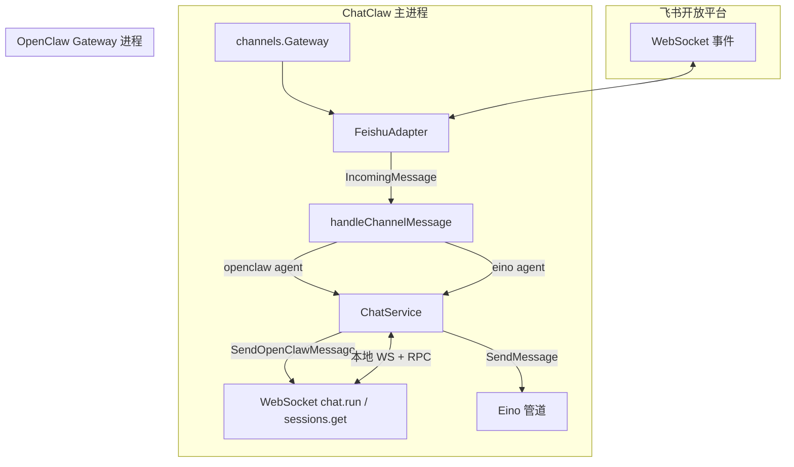

# OpenClaw 飞书渠道（Feishu / Lark）

本目录的 `OpenClawChannelService`（见 `service.go`）在**共享渠道基础设施**之上提供 OpenClaw 专用的飞书渠道管理：列表过滤、创建飞书渠道、绑定 `openclaw_agents`、委托连接/校验等。**飞书协议实现**在 `internal/services/channels`（`FeishuAdapter`、`ChannelService`、`Gateway`）；**入站消息与 OpenClaw 推理衔接**在 `internal/bootstrap/app.go`。

下文说明 ChatClaw 桌面应用内 OpenClaw 与飞书渠道的集成方式、消息生命周期、与主渠道差异、架构小结，以及渠道配置与频道开关和 OpenClaw 的关系。

---

## 1. 应用与 OpenClaw 的通信机制

### 1.1 进程与运行时

- **ChatClaw 主进程**：Wails 应用，承载 UI、SQLite、渠道 Gateway、会话与聊天服务。
- **OpenClaw Gateway**：由 `openclawruntime.Manager` 在本地启动/管理的独立进程，对外提供 **WebSocket** 接口（含鉴权 Token、固定端口等，状态通过 `openclaw:status` / `openclaw:gateway-state` 等事件同步到前端）。
- **注入关系**：启动时在 `bootstrap` 中 `chatService.SetOpenClawGateway(openclawManager)`，聊天层通过 `OpenClawGatewayInfo` 抽象访问 Gateway：判断是否就绪（`IsReady`）、调用 `Request` / `QueryRequest`（如 `sessions.get`）、订阅 Gateway 事件。

### 1.2 聊天路径（与 UI 同源）

- **OpenClaw 会话**（`conversations.agent_type = openclaw`）：发送用户消息时走 `ChatService.SendOpenClawMessage`，内部使用 Gateway 的 **`chat.run`**（及流式 token 回调），**会话正文由 OpenClaw 侧维护**，本地库不持久化完整消息历史（与 Eino 管道区分）。
- **Session Key**：`agent:<openclaw_agent_id>:conv_<conversationID>`，与 OpenClaw 文档中的 agent 作用域会话一致，避免与默认 `main` agent 串会话。

### 1.3 前端与后端的桥接

- OpenClaw 相关页面（如 OpenClaw 渠道页）通过 **Wails 生成绑定** 调用 `OpenClawChannelService`（列表、创建飞书渠道、绑定 OpenClaw Agent、连接/断开等）。
- OpenClaw 运行时状态、模型配置等由 `OpenClawRuntimeService` 等暴露给前端；Gateway 就绪与否直接影响 `SendOpenClawMessage` 是否成功（渠道回复失败时会提示 Gateway 未就绪类错误）。

---

## 2. 从飞书收消息到回复的完整生命周期

下列步骤对 **同一套** `FeishuAdapter`（飞书开放平台长连接 WebSocket）生效；差异仅在「由谁生成回复」。

### 2.1 接入与收消息

1. 用户在 OpenClaw 渠道页创建 **飞书** 渠道，填写 `app_id` / `app_secret`（`extra_config` JSON），可选绑定 `openclaw_agents` 中的 Agent；启用并 **连接**。
2. `channels.Gateway.ConnectChannel` 为该行创建 `FeishuAdapter`，使用 Lark SDK **WebSocket 长连接** 订阅事件，`OnP2MessageReceiveV1` 收到消息后回调统一 `MessageHandler`。

### 2.2 应用内分发（`handleChannelMessage`）

3. 解析出文本内容；若无绑定 `agent_id` 则丢弃。
4. 根据 `agent_id` 是否在表 **`openclaw_agents`** 中判定 **`agentType`**：存在则为 OpenClaw Agent，否则为 ChatClaw（Eino）Agent。
5. 以 `ch:<channelID>:<chatId或senderId>` 为外部键 **查找或创建会话**，并向前端发 `channel:conversation-activated` 等事件。
6. 支持快捷指令前缀 `/q`、`/quick` 强制非流式；支持通过固定中文指令切换飞书侧 **流式卡片** 开关（写入 `extra_config`）。

### 2.3 OpenClaw 路径的生成与回传

7. **若 `agentType == openclaw`**：调用 `runOpenClawChannelReply` → `SendOpenClawMessage`（走 Gateway **`chat.run`**），**不**走 `chatService.SendMessage` 的 Eino 管道。
8. **飞书流式回复（可选）**：当平台为飞书、未使用 quick 模式、且渠道配置开启流式输出时，通过当前渠道的 `FeishuAdapter` 创建 **流式卡片**，并周期性用 `GetGenerationContent` 拉取增量正文更新卡片，结束时标记完成；若建卡失败则回退为等整段生成后再回复。
9. **非流式**：`WaitForGeneration` 结束后用 `openClawFinalResponse` 取最终文本（内存生成内容或 `sessions.get` / `GetOpenClawLastAssistantReply`），再经 `sendChannelReply` —— 飞书侧优先 **引用回复**（`ReplyMessage`）到原消息。
10. 更新会话 `LastMessage` 并 `Emit` `conversations:changed`、`chat:messages-changed`。

### 2.4 ChatClaw（非 OpenClaw）同渠道对比（同一适配器）

- 若 Agent 属于 **`agents` 表**：同一入口进入 `chatService.SendMessage`（Eino），飞书流式仍可用 `streamFeishuReply`，逻辑与 OpenClaw 分支对称但 **不**调用 `SendOpenClawMessage`。

---

## 3. 与 ChatClaw 渠道的联系与区别

| 维度 | ChatClaw 渠道 | OpenClaw 渠道 |
|------|----------------|---------------|
| 数据表 | `channels` + `agents`，`openclaw_scope` 通常为 false | 同一 `channels` 表；创建时 **`OpenClawScope: true`**，或行级规则：仅绑定 **`openclaw_agents`** 的渠道视为 OpenClaw 可见 |
| UI 入口 | 主应用「渠道」等页面，多平台可建 | OpenClaw 专用渠道页；**当前仅允许创建飞书**，其余平台占位「即将推出」 |
| Agent | `agents` 表，Eino 管线 | `openclaw_agents` 表（含 `openclaw_agent_id` 与 Gateway 侧 agent 对应） |
| 回复链路 | `SendMessage` → Eino | `SendOpenClawMessage` → Gateway **`chat.run`** |
| 会话类型 | `conversations.agent_type` 默认 | `agent_type = openclaw` |
| 底层 IM | **相同** `FeishuAdapter`、相同 Gateway 连接池 | 相同 |

**联系**：飞书长连接、消息解析、回复 API（含流式卡片）**共用** `internal/services/channels`；区别集中在 **Agent 归属** 与 **模型推理后端**（Eino vs OpenClaw Gateway）。

---

## 4. 整体架构小结

- **飞书 ↔ 应用**：Lark 官方 SDK，应用凭证长连接收消息、HTTP/卡片 API 发消息与流式更新。
- **应用 ↔ OpenClaw**：本地 Gateway 进程，聊天与会话查询走 WebSocket RPC；渠道场景下由 `runOpenClawChannelReply` 统一衔接「IM 回调 → 会话 → OpenClaw 生成 → IM 回写」。
- **数据**：渠道行仍存于共享 `channels` 表；通过 `openclaw_scope` 与 `openclaw_agents` 绑定关系将 OpenClaw 渠道与 ChatClaw 列表隔离，避免 `agent_id` 跨两套 Agent 表误用。

---

## 5. 渠道配置与 OpenClaw 的关系（重要：不「写入」OpenClaw）

### 5.1 飞书渠道配置存在哪里

- **落库位置**：`channels` 表的 `extra_config`（JSON，含飞书 `app_id`、`app_secret`、可选 `stream_output_enabled` 等），由 `ChannelService` / `OpenClawChannelService` 创建或更新。
- **使用方**：仅 **`FeishuAdapter`** 在 `Connect` 时读取，用于与**飞书开放平台**建立长连接、拉 tenant token、收发消息与卡片；**不会**通过 OpenClaw Gateway 的 RPC 把这份 JSON 推给 OpenClaw 进程。
- **OpenClaw 侧可见的配置**：推理路径只依赖会话关联的 **`openclaw_agents.openclaw_agent_id`**（以及会话 key 等），由 `getOpenClawAgentConfig` 从 DB 读出后参与 `agent` / `sessions.get` 调用。**飞书 App 密钥不属于 OpenClaw 配置模型的一部分。**

### 5.2 概念拆分（避免混淆）

| 对象 | 作用 |
|------|------|
| 飞书 `extra_config` | 仅 ChatClaw 主进程 ↔ 飞书云 |
| `openclaw_agents`（含 `openclaw_agent_id`） | ChatClaw 主进程 ↔ OpenClaw Gateway（`chat.run` 等） |
| OpenClaw Runtime 其它配置（模型、工作区等） | 由 `openclawruntime` / 设置服务管理，与「飞书渠道行」无直接同步关系 |

因此：**「渠道配置写入 OpenClaw」在实现上不存在**；是「本地渠道表 + 本地 OpenClaw Agent 表」两条线，在 `handleChannelMessage` 里拼成「飞书收消息 → 用 OpenClaw Agent id 调 Gateway」。

---

## 6. 频道开启 / 关闭与 OpenClaw 的通信

### 6.1 实际发生的事（无「渠道级」OpenClaw RPC）

`ChannelService.ConnectChannel` / `DisconnectChannel`（OpenClaw 渠道与普通渠道共用）只做：

1. **SQLite**：`enabled = true/false`，并更新 `updated_at`。
2. **IM Gateway**：`gateway.ConnectChannel` 启动该 `channel_id` 的 `FeishuAdapter`（长连接飞书），或 `DisconnectChannel` 断开适配器并移出内存 map。

**不会对 `openclawruntime.Manager` 发「开频道 / 关频道」类调用**；OpenClaw Gateway 进程的生命周期由应用启动/退出、用户在前端对 OpenClaw 运行时的操作等**独立**管理。

### 6.2 与 OpenClaw 的间接关系

- **频道关闭（断开）**：飞书侧不再收事件 → `handleChannelMessage` 不会触发 → **不会**调用 `SendOpenClawMessage`。OpenClaw Gateway 仍可处于运行状态，只是本渠道不再产生对话请求。
- **频道开启（连接）**：仅恢复飞书长连接；若用户从未启动 OpenClaw Gateway 或 Gateway 未就绪，**连接飞书仍可成功**，但收到消息后在 OpenClaw 分支会因 `SendOpenClawMessage` 失败而回复错误提示（如 Gateway 未就绪类文案）。
- **总结**：**频道开关 = 飞书连接开关 + DB `enabled`**；**OpenClaw = 独立进程 + 仅在生成回复时通过 WebSocket RPC 交互**。二者在代码路径上解耦，仅通过「是否有入站消息需要推理」串联。

---

## 参考代码位置

| 主题 | 路径 |
|------|------|
| 渠道消息总入口与 OpenClaw 分支 | `internal/bootstrap/app.go`（`handleChannelMessage`、`runOpenClawChannelReply`、`streamOpenClawFeishuReply`） |
| OpenClaw 聊天与 Gateway | `internal/services/chat/openclaw_chat.go` |
| Gateway 生命周期 | `internal/services/openclawruntime/manager.go` |
| 本包 OpenClaw 渠道 API | `internal/services/openclaw/channels/service.go` |
| 渠道启用与 `extra_config` | `internal/services/channels/service.go` |
| 飞书适配器 | `internal/services/channels/feishu_adapter.go` |
| OpenClaw 渠道 UI | `frontend/src/pages/openclaw/channels/OpenClawChannelsPage.vue` |
